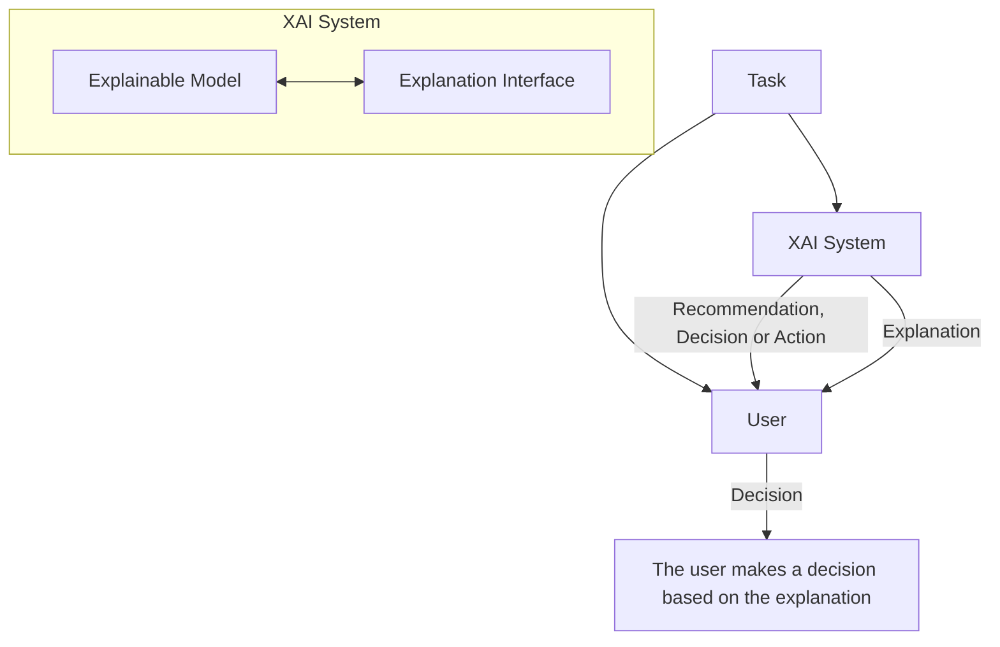
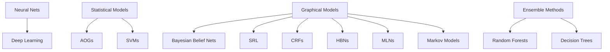
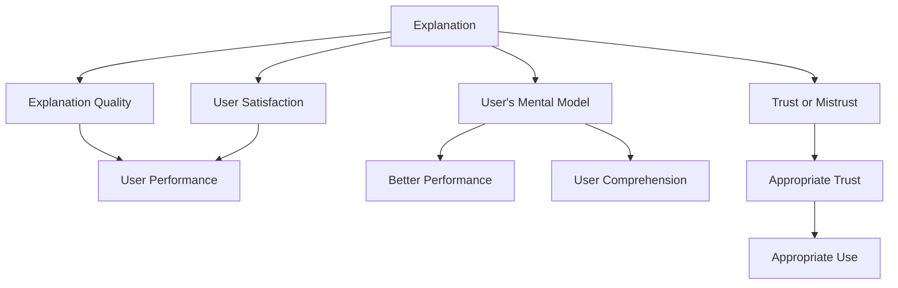
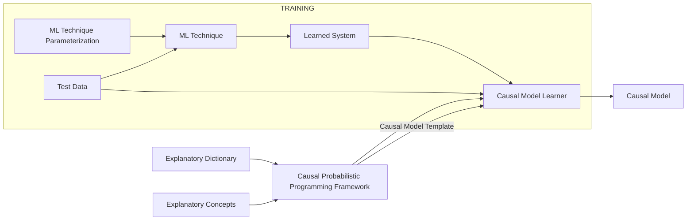

# The Need for Explainable AI

DARPA    The Need for Explainable AI    XAI EXPLAINABLE ARTIFICIAL INTELLIGENCE

| ## AI System AI System diagram - We are entering a new age of AI applications - Machine learning is the core technology - Machine learning models are opaque, non-intuitive, and difficult for people to understand | Transportation image Transportation	Finance image Finance&#xA;Security image Security	Legal image Legal&#xA;Medicine image Medicine	Military image Military |
| ------------------------------------------------------------------------------------------------------------------------------------------------------------------------------------------------------------------- | ----------------------------------------------------------------------------------------------------------------------------------------------------------- |

</td>
<td>

## User

![User icon]

- Why did you do that?
- Why not something else?
- When do you succeed?
- When do you fail?
- When can I trust you?
- How do I correct an error?

</td>
</tr>
</table>

- The current generation of AI systems offer tremendous benefits, but their effectiveness will be limited by the machine's inability to explain its decisions and actions to users

- Explainable AI will be essential if users are to understand, appropriately trust, and effectively manage this incoming generation of artificially intelligent partners

Approved for public release: distribution unlimited.    2
---

# XAI In the News

|  |   |  |
| ----------------------------- | - | ------------------------- |

|  ## MIT Technology Review ### The Dark Secret at the Heart of AI Will Knight April 11, 2017          |  ## Inside DARPA's Push to Make Artificial Intelligence Explain Itself Sara Castellanos and Steven Norton August 10, 2017              |  ## Can A.I. Be Taught to Explain Itself? Cliff Kuang November 21, 2017                                           |
| ------------------------------------------------------------------------------------------------------------------------------------------------------------------- | ------------------------------------------------------------------------------------------------------------------------------------------------------------------------------- | ------------------------------------------------------------------------------------------------------------------------------------------------------------------------- |
|  ## Intelligent Machines Are Asked to Explain How Their Minds Work Richard Waters July 11, 2017                                 |  ## You better explain yourself, mister: DARPA's mission to make an accountable AI Dan Robinson September 29, 2017                   |  ## Charles River Analytics-Led Team Gets DARPA Contract to Support Artificial Intelligence Program Ramona Adams June 13, 2017 |
|  ## Elon Musk and Mark Zuckerberg Are Arguing About AI -- But They're Both Missing the Point Artur Kiulian July 28, 2017 |  ## Team investigates artificial intelligence, machine learning in DARPA project Lisa Daigle June 14, 2017 |  ## Why The Military And Corporate America Want To Make AI Explain Itself Steven Melendez June 22, 2017                        |
|  ## DARPA's XAI seeks explanations from autonomous systems Geoff Fein November 16, 2017                                               |  ## Ghosts in the Machine Christina Couch October 25, 2017                                                                                 |  ## How AI detectives are cracking open the black box of deep learning Paul Voosen July 6, 2017                                          |
|  ## Oracle quietly researching 'Explainable AI' George Nott May 5, 2017                                                |  ## Demystifying the Black Box That Is AI Ariel Bleicher August 9, 2017                                                |                                                                                                                                                                           |

Approved for public release: distribution unlimited.

3
---

DARPA What Are We Trying To Do? XAI
EXPLAINABLE ARTIFICIAL INTELLIGENCE

# What Are We Trying To Do?

## Today

Training Data: 

Learned Function: 

Output: This is a cat (p = .93)

User with a Task:
- Why did you do that?
- Why not something else?
- When do you succeed?
- When do you fail?
- When can I trust you?
- How do I correct an error?

## Tomorrow

Training Data: 

Explanation Interface:
This is a cat:
- It has fur, whiskers, and claws.
- It has this feature: [Images of cat features]

User with a Task:
- I understand why
- I understand why not
- I know when you'll succeed
- I know when you'll fail
- I know when to trust you
- I know why you erred

Approved for public release: distribution unlimited. 5
---

# Challenge Problems

| Learn a model                                                                                                                  | Explain decisions                       | Use the explanation |
| ------------------------------------------------------------------------------------------------------------------------------ | --------------------------------------- | ------------------- |
| **Data Analytics** Classification Learning Task                                                                            |                                         |                     |
| Multimedia Data \[Image description: Aerial view of two trucks performing a loading activity] © Air Force Research Lab | Explainable Model	Explanation Interface |                     |

      </td>
      <td>
        [Image description: An analyst looking at multiple computer screens] 
        © Getty Images
      </td>
    </tr>
    <tr>
      <td>Classifies items of interest in large data set</td>
      <td>Explains why/why not for recommended items</td>
      <td>Analyst decides which items to report, pursue</td>
    </tr>
    <tr>
      <td colspan="3">An analyst is looking for items of interest in massive multimedia data sets</td>
    </tr>
    <tr>
      <td colspan="3">
        <strong>Autonomy</strong> 
        Reinforcement Learning Task
      </td>
    </tr>
    <tr>
      <td>
        ArduPilot & SITL Simulation 
        [Image description: Multiple diagrams showing different configurations of ArduCopter V3.0.1] 
        © ArduPilot.org
      </td>
      <td>
        

| Explainable Model | Explanation Interface |
| ----------------- | --------------------- |

      </td>
      <td>
        [Image description: An autonomous aerial vehicle hovering over a field with two soldiers in the foreground] 
        © US Army
      </td>
    </tr>
    <tr>
      <td>Learns decision policies for simulated missions</td>
      <td>Explains behavior in an after-action review</td>
      <td>Operator decides which future tasks to delegate</td>
    </tr>
    <tr>
      <td colspan="3">An operator is directing autonomous systems to accomplish a series of missions</td>
    </tr>
  </tbody>
</table>

Approved for public release: distribution unlimited.
---

# Goal: Performance and Explainability

DARPA logo XAI
EXPLAINABLE ARTIFICIAL INTELLIGENCE

- XAI will create a suite of machine learning techniques that
  - Produce more explainable models, while maintaining a high level of learning performance (e.g., prediction accuracy)
  - Enable human users to understand, appropriately trust, and effectively manage the emerging generation of artificially intelligent partners

## Performance vs. Explainability

| \`\`\`mermaid graph LR A\[Explainability (notional)] --> B\[Learning Performance] style A fill:none,stroke:none style B fill:none,stroke:none subgraph Today C((Today)) end subgraph Tomorrow D((Tomorrow)) end C --> \|Moves towards\| D style C fill:#FFA500,stroke:#FFA500 style D fill:#90EE90,stroke:#90EE90 \`\`\` |
| ------------------------------------------------------------------------------------------------------------------------------------------------------------------------------------------------------------------------------------------------------------------------------------------------------------------------ |

Approved for public release: distribution unlimited.                   7
---

# Measuring Explanation Effectiveness

XAI

EXPLAINABLE ARTIFICIAL INTELLIGENCE

## Explanation Framework

**XAI System**
The system takes input from the current task and makes a recommendation, decision, or action

**Explanation**
The system provides an explanation to the user that justifies its recommendation, decision, or action

## Measure of Explanation Effectiveness

| User Satisfaction                                                                                                                                                                      |   |
| -------------------------------------------------------------------------------------------------------------------------------------------------------------------------------------- | - |
| • Clarity of the explanation (user rating) • Utility of the explanation (user rating)                                                                                              |   |
| Mental Model                                                                                                                                                                           |   |
| • Understanding individual decisions • Understanding the overall model • Strength/weakness assessment • 'What will it do' prediction • 'How do I intervene' prediction |   |
| Task Performance                                                                                                                                                                       |   |
| • Does the explanation improve the user's decision, task performance? • Artificial decision tasks introduced to diagnose the user's understanding                                  |   |
| Trust Assessment                                                                                                                                                                       |   |
| • Appropriate future use and trust                                                                                                                                                     |   |
| Correctability (Extra Credit)                                                                                                                                                          |   |
| • Identifying errors • Correcting errors • Continuous training                                                                                                                 |   |

Approved for public release: distribution unlimited.                        8
---

# Performance vs. Explainability

    
    DARPA
    XAI

## New Approach

Create a suite of machine learning techniques that produce more explainable models, while maintaining a high level of learning performance

## Learning Techniques (today)

## Explainability (notional)

| Learning Performance | Explainability |
| -------------------- | -------------- |
|                      |                |

### Deep Explanation
Modified deep learning techniques to learn explainable features

Deep Explanation Diagram

### Interpretable Models
Techniques to learn more structured, interpretable, causal models

Interpretable Models Diagram

### Model Induction
Techniques to infer an explainable model from any model as a black box

| Model |
| ----- |
| ?     |

    </td>
  </tr>
  <tr>
    <td>Experiment</td>
  </tr>
</table>

Approved for public release: distribution unlimited.

10
---

# XAI Concept and Technical Approaches

XAI EXPLAINABLE ARTIFICIAL INTELLIGENCE

![DARPA logo]

## Training Data

[Image showing multiple scenes of military vehicles and personnel]

→ New Learning Process → Explainable Model | Explanation Interface ↔ [Icon of a person using a laptop]

|                         | Explainable Model    | Explanation Interface      |
| ----------------------- | -------------------- | -------------------------- |
| UC Berkeley             | Deep Learning        | Reflexive and Rational     |
| Charles River Analytics | Causal Modeling      | Narrative Generation       |
| UCLA                    | Pattern Theory+      | 3-Level Explanation        |
| Oregon State            | Adaptive Programs    | Acceptance Testing         |
| PARC                    | Cognitive Modeling   | Interactive Training       |
| CMU                     | Explainable RL (XRL) | XRL Interaction            |
| SRI International       | Deep Learning        | Show and Tell Explanations |
| Raytheon BBN            | Deep Learning        | Argumentation and Pedagogy |
| UT Dallas               | Probabilistic Logic  | Decision Diagrams          |
| Texas A\&M              | Mimic Learning       | Interactive Visualization  |
| Rutgers                 | Model Induction      | Bayesian Teaching          |

### IHMC Psychological Model of Explanation

Approved for public release: distribution unlimited.                                                            11
---

# Network Dissection Quantifying Interpretability of Deep Representations (MIT)

    
DARPA

    
XAI

## Buildings

| 56) building         | 120) arcade        | 8) bridge          | 123) building        |
| -------------------- | ------------------ | ------------------ | -------------------- |
| \[5 building images] | \[5 arcade images] | \[5 bridge images] | \[5 building images] |

## Furniture

| 18) billiard table         | 155) bookcase        | 116) bed        | 38) cabinet         |
| -------------------------- | -------------------- | --------------- | ------------------- |
| \[5 billiard table images] | \[5 bookcase images] | \[5 bed images] | \[5 cabinet images] |

## Indoor objects

| 182) food        | 46) painting         | 106) screen        | 53) staircase         |
| ---------------- | -------------------- | ------------------ | --------------------- |
| \[5 food images] | \[5 painting images] | \[5 screen images] | \[5 staircase images] |

Interpretation of several units in pool5 of AlexNet trained for place recognition

Audit trail: for a particular output unit, the drawing shows the most strongly activated path

[Network diagram with colored paths between nodes]

Approved for public release: distribution unlimited.    13
---

# Causal Model Induction (CRA)

Causal Model Induction: Experiment with the learned model (as a grey box) to learn an explainable, causal, probabilistic programming model

Approved for public release: distribution unlimited.                        14
---

# Four Modes of Explanation (Raytheon BBN)

| **Analytic (didactic) statements** in natural language that describe the elements and context that support a choice | **Visualizations** that directly highlight portions of the raw data that support a choice and allow viewers to form their own perceptual understanding       |
| :---------------------------------------------------------------------------------------------------------------------: | ---------------------------------------------------------------------------------------------------------------------------------------------------------------- |
|                                                **Explanation Modes**                                                |                                                                                                                                                                  |
|                      **Cases** that invoke specific examples or stories that support the choice                     | **Rejections of alternative choices** (or "common misconceptions" in pedagogy) that argue against less preferred answers based on analytics, cases, and data |

Approved for public release: distribution unlimited.

17
---

# XAI Program Structure

| Challenge Problem Areas                                                                                      | TA1: Explainable Learners                                                                                                                                                 | TA2: Psychological Model of Explanation                                | Evaluation Framework                                                                                                                                                              |
| ------------------------------------------------------------------------------------------------------------ | ------------------------------------------------------------------------------------------------------------------------------------------------------------------------- | ---------------------------------------------------------------------- | --------------------------------------------------------------------------------------------------------------------------------------------------------------------------------- |
| Two trucks performing a loading activity Data Analytics Multimedia Data Autonomy ArduPilot & SITL Simulation | Teams that provide prototype systems with both components • Explainable Model • Explanation Interface Deep Learning Teams Interpretable Model Teams Model Induction Teams | • Psychological Theory of Explanation • Computational Model Consulting | \[Graph showing Learning Performance vs Explanation Effectiveness] Explanation Measures • User Satisfaction • Mental Model • Task Performance • Trust Assessment • Correctability |

## Evaluator
Naval Research Laboratory

- TA1: Explainable Learners
  - Multiple TA1 teams will develop prototype explainable learning systems that include both an explainable model and an explanation interface

- TA2: Psychological Model of Explanation
  - At least one TA2 team will summarize current psychological theories of explanation and develop a computational model of explanation from those theories

Approved for public release: distribution unlimited.                                               18